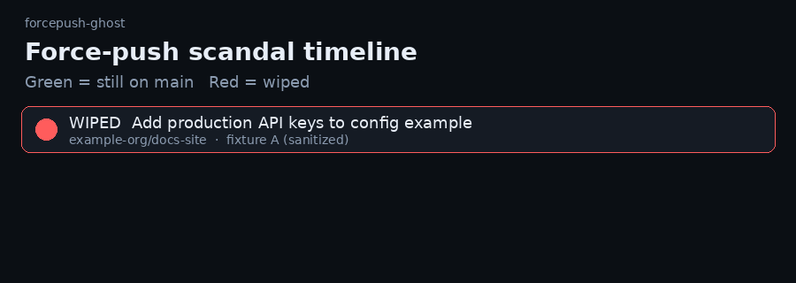

# forcepush-ghost

**The force-push scandal timeline for any public repo.**



Green = still on the default branch. Red = wiped by a force-push.

### Try it in 10 seconds (offline)

```bash
npx forcepush-ghost --fixture scandal-a
```

Or open `demo/index.html` — two scandal fixtures and one clean bill of health play with zero install and zero network.

### Live public repo (optional)

```bash
npx forcepush-ghost owner/repo
```

Uses recent public GitHub Events only. If the API fails or rate-limits, the CLI exits without inventing a timeline — use `--fixture` instead. This is a **timeline / story** tool — not a secret scanner.

## What you are looking at

Commits that used to exist on a branch and then disappeared after a force-push, shown as a red-✕ timeline. Offline fixtures are sanitized reconstructions so the story is always reproducible.

## Offline fixtures

```bash
npx forcepush-ghost --fixture scandal-a
npx forcepush-ghost --fixture scandal-b
npx forcepush-ghost --fixture clean
```

## Limitations

- Live mode only sees the recent public Events window — older rewrites may be invisible
- Offline fixtures are sanitized demos, never dressed up as a live scan of your target
- Not a secret scanner and not secret recovery

## License

MIT
