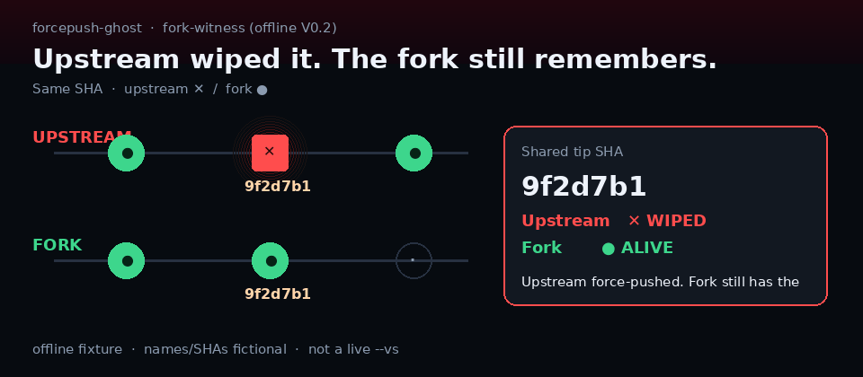

# forcepush-ghost

**Upstream wiped it. The fork still remembers.**



Same SHA: upstream ✕ wiped · fork ● still alive. Classic scandal timeline GIF still in `demo/timeline.gif`.

### Zero install (start here)

**[Live demo →](https://caoshurong.github.io/forcepush-ghost/demo/)** — offline dual-rail (Fork-witness A): upstream ✕ / fork ●. Fixtures only; no auth, no clone.

Or open `demo/index.html` after clone — same story, zero network.

### CLI — Path B primary (GitHub one-liner / clone; registry later)

Path B = `fork-witness-a` dual-rail. Path A (`scandal-a`) is **alternate** only. See [`launch/INSTALL_NO_NPM.md`](launch/INSTALL_NO_NPM.md).

```bash
# zero install from GitHub (Path B):
npx github:CAOShurong/forcepush-ghost --fixture fork-witness-a

# from a clone (Path B):
node bin/forcepush-ghost.js --fixture fork-witness-a
# or: npm run path-b

# global from GitHub (still no registry):
# npm i -g github:CAOShurong/forcepush-ghost && forcepush-ghost --fixture fork-witness-a

# Path A alternate (classic scandal timeline):
node bin/forcepush-ghost.js --fixture scandal-a

# scripting: structured JSON of the same timeline object (Pages stays offline; live --vs is CLI-only)
node bin/forcepush-ghost.js --fixture fork-witness-a --json
# human-readable indent: add --pretty
node bin/forcepush-ghost.js --fixture fork-witness-a --json --pretty
```

### Live public scan (CLI)

```bash
npx github:CAOShurong/forcepush-ghost owner/repo
# from a clone: node bin/forcepush-ghost.js owner/repo
```

Showcase (real public repo with live ✕ on tip):

```bash
node bin/forcepush-ghost.js mrdoob/three.js
```

### Live fork-witness (`--vs`, CLI only)

```bash
node bin/forcepush-ghost.js upstream/repo --vs forkOwner
node bin/forcepush-ghost.js upstream/repo --vs forkOwner/forkRepo
node bin/forcepush-ghost.js upstream/repo --vs auto
```

Same repo name when only `forkOwner` is given. Probes whether a fork still holds wiped / `before` tip SHAs after an upstream rewrite. Fail closed: API errors exit 2 and never substitute fixtures; fork missing a SHA prints upstream ✕ / fork ——. Same-repo `--vs` (upstream === fork) is refused with exit 2 — pick a different fork owner.

`--vs auto` enumerates capped public forks (hard cap 2 pages / ~60 forks, stargazers order), probes which still hold wiped/`before` tip SHA(s), and picks a **public fork that still holds tip SHA** (prefer higher stargazers among holders — never claim "best"/"most scandalous"). Find none → exit 2; never invent a dual-hit. Rate-limit Remaining=0 → stop early and say so. Prefer an explicit `--vs forkOwner` when you already know the witness.

Verified dual-hit showcase (Upstream ✕ | Fork ● on shared tip SHA):

```bash
node bin/forcepush-ghost.js mrdoob/three.js --vs alteredq
# optional alt fork: --vs brunosimon
# optional alt: pocketbase/pocketbase --vs fondoger
```

**Pages stays offline fixtures** — the demo never runs live `--vs` / `--vs auto`.

Live mode reads recent public GitHub Events for force-push signals and prints the same story timeline. Optional `GITHUB_TOKEN` / `GH_TOKEN` raises rate limits; if unset, the CLI soft-tries `gh auth token` when the GitHub CLI is logged in. The visual demo stays offline-fixtures so it never pretends it scanned a repo it did not.

## What you are looking at

A public timeline of commits that used to exist on a branch and then disappeared after a force-push. Offline fixtures are sanitized reconstructions so the story is always reproducible. Live scan is story/timeline only — not a secret scanner.

## Real-world shape (sanitized in fixtures)

- **Jenkins, Nov 2013** — misconfigured Gerrit replication force-pushed stale clones across ~186 repos → Fixture Scandal A ([summary](https://www.jenkins.io/blog/2013/11/25/summary-report-git-repository-disruption-incident-of-nov-10th/), [InfoQ](https://www.infoq.com/news/2013/11/use-the-force/))
- **CocoaPods Specs, Jan 2014** — libgit2/GitHub web-editor corruption forced a Specs history rewrite → Fixture Scandal B ([postmortem](https://blog.cocoapods.org/Repairing-Our-Broken-Specs-Repository/))
- **GitHub Protected Branches, Sep 2015** — product motivation included blocking accidental force-pushes that overwrite others' work → *why wipe matters* background only ([announcement](https://github.blog/news-insights/product-news/protected-branches-and-required-status-checks/)). **This tool does not detect protected branches.**

Names/SHAs in fixtures are fictional. Not live scans of `jenkinsci/*` or `CocoaPods/Specs`.

## Offline fixtures

```bash
node bin/forcepush-ghost.js --fixture fork-witness-a   # Path B primary — offline dual-rail
node bin/forcepush-ghost.js --fixture fork-witness-clean
node bin/forcepush-ghost.js --fixture scandal-a
node bin/forcepush-ghost.js --fixture scandal-b
node bin/forcepush-ghost.js --fixture clean
```

Open the [Live demo](https://caoshurong.github.io/forcepush-ghost/demo/) for the visual timeline (red ✕ = wiped).


### Fork-witness offline preview (V0.2)

Dual-rail fixtures: same SHA on **upstream ✕** vs **fork ●**. Offline preview for Pages; live compare is CLI `--vs` only.

```bash
node bin/forcepush-ghost.js --fixture fork-witness-a
node bin/forcepush-ghost.js --fixture fork-witness-clean
```

Pages: pick **Fork-witness A** in the demo select. Hook: *Upstream wiped it. The fork still remembers.*

## Limitations

- Live scan uses the public Events window only — older rewrites can fall outside it; Events pagination follows Link next up to 3 pages and stops early on rate-limit remaining=0 (no invented rows); PushEvents that omit `forced=true` get an honest compare budget (default 40) so busy-repo fast-forward noise does not starve later in-window diverged/before-missing tip discovery for `--vs auto`
- Demo UI is offline fixtures; live `owner/repo` and live `--vs` / `--vs auto` are CLI only (Pages never runs live `--vs` / `--vs auto`)
- Offline fixtures are sanitized — not real scandals dressed up as live results
- Story/timeline positioning only — not a secret scanner and not secret recovery
- GitHub's Activity view can filter Force pushes and show a `before` SHA — same shape as our ✕ timeline. We do **not** replace Activity, and we do **not** offer recovery/restore buttons
- Registry `npx forcepush-ghost` works only after npm publish; until then use Pages, `npx github:CAOShurong/forcepush-ghost`, or `node bin/…` from a clone

## License

MIT
